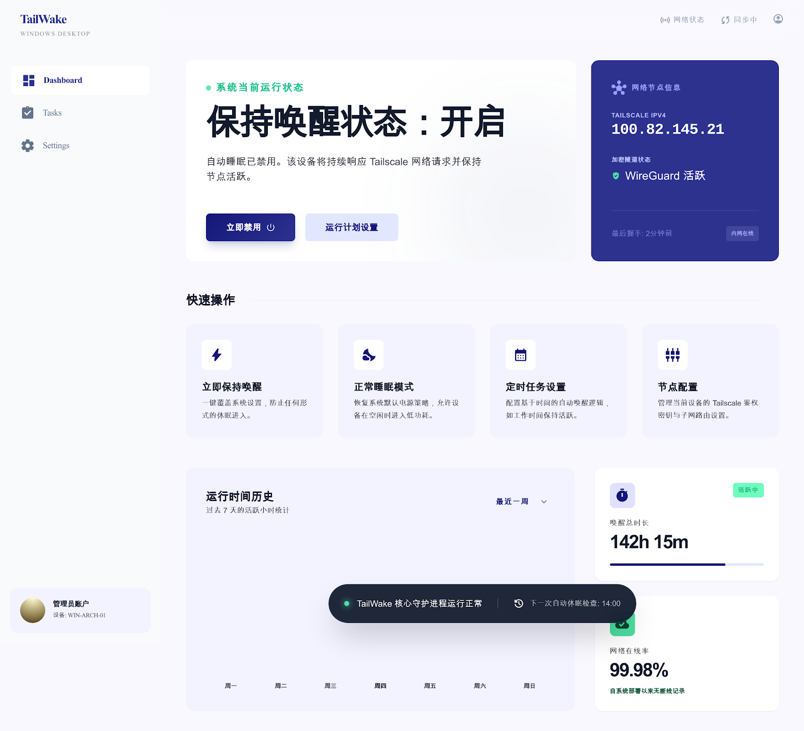
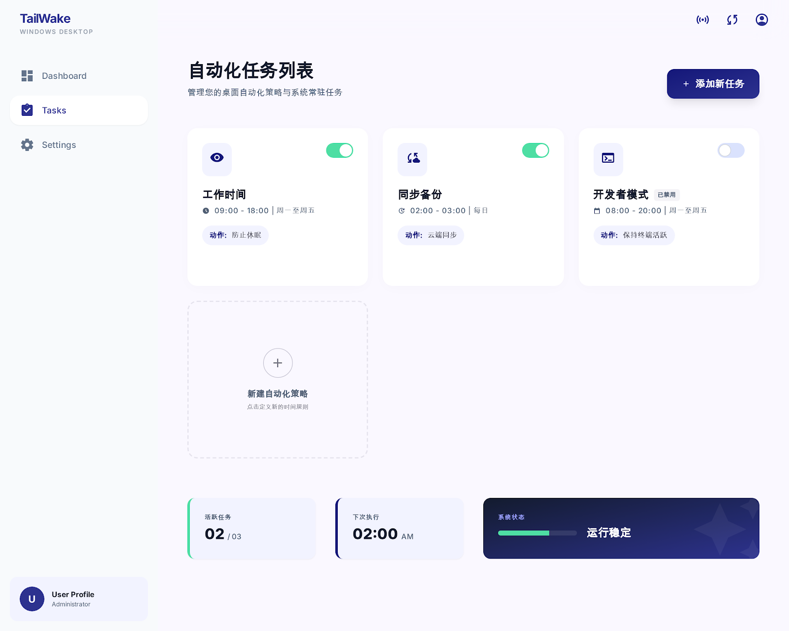
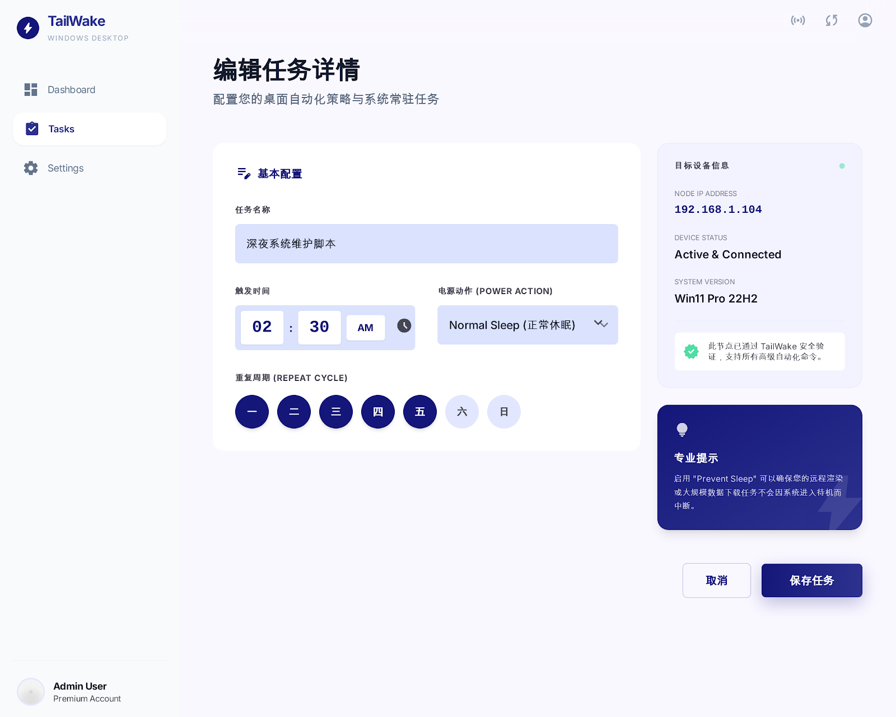
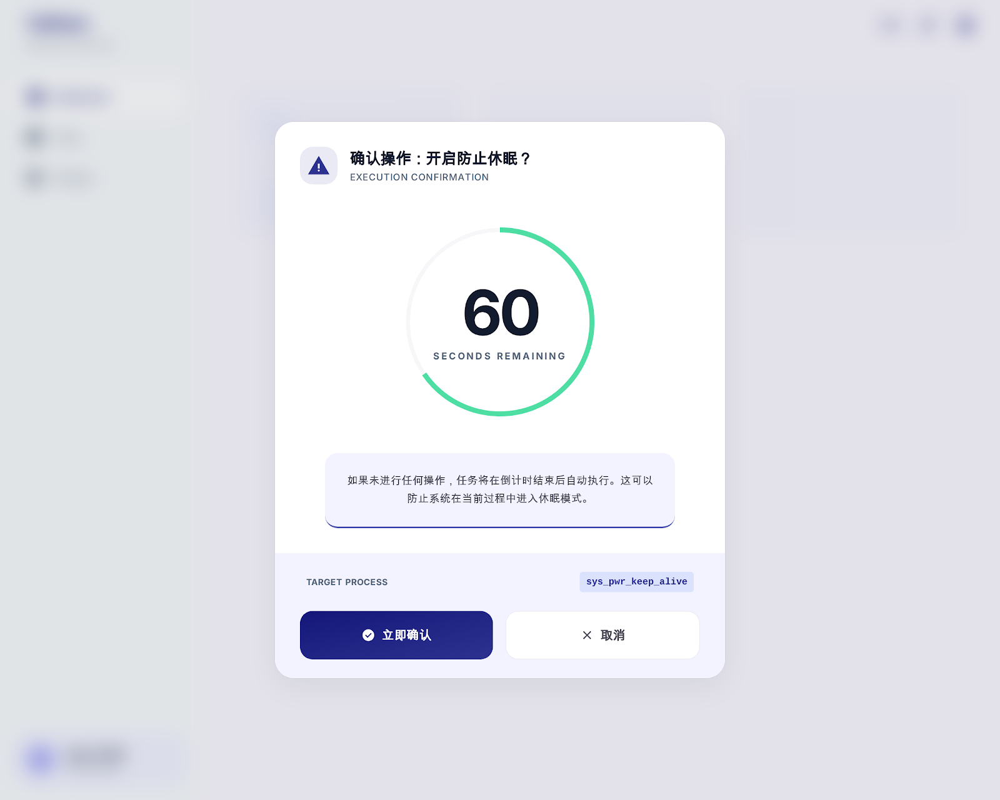

# TailWake

防止 Tailscale 连接的笔记本电脑因休眠而断网失联的轻量级 Windows 工具。

## 项目简介

TailWake 是一个专业的远程唤醒与桌面自动化管理工具，提供直观的 PyQt6 GUI 界面来管理 Wake-on-LAN 任务和系统自动化策略。通过定时任务动态切换系统休眠策略，确保远程访问的可靠性。

## 界面预览



### 自动化任务列表



### 任务编辑



### 确认弹窗



## 技术栈

| 项目 | 选择 | 理由 |
|------|------|------|
| GUI 框架 | PyQt6 | 最新版本，LGPL 协议，社区活跃 |
| 调度器 | APScheduler (BackgroundScheduler) | 灵活的内存调度，支持固定时间和间隔任务 |
| 开机自启 | 注册表 HKCU\Run | 无需管理员权限，绿色便携 |
| 配置存储 | 程序目录 config.json | 绿色便携，换电脑直接复制 |
| 打包工具 | PyInstaller | 单文件 exe，便于分发 |

## 项目结构

```
TailWake/
├── main.py                    # 程序入口，初始化应用
├── config.py                  # 配置文件读写、默认配置
├── models.py                  # 数据模型（Task, HistoryRecord, AppConfig）
├── power_control.py           # 电源策略控制（powercfg 调用）
├── tailscale_status.py        # Tailscale 状态获取
├── scheduler.py               # APScheduler 封装，任务调度逻辑
├── history_tracker.py         # 运行时间历史记录
├── autostart.py               # 开机自启（注册表方式）
├── styles.py                  # 样式定义（颜色、字体、QSS）
├── main_window.py             # 主窗口（侧边栏 + 内容区）
├── tray.py                    # 系统托盘图标与菜单
├── widgets/                   # 自定义控件
│   ├── __init__.py
│   ├── sidebar.py             # 侧边栏导航
│   ├── toggle_switch.py       # 开关控件
│   ├── task_card.py           # 任务卡片
│   ├── countdown_dialog.py    # 倒计时确认弹窗
│   └── progress_ring.py       # 圆形进度环
├── pages/                     # 页面
│   ├── __init__.py
│   ├── dashboard_page.py      # Dashboard 主页面
│   ├── tasks_page.py          # 任务列表页面
│   ├── task_edit_page.py      # 任务编辑页面
│   └── settings_page.py       # 设置页面
├── resources/
│   └── fonts/                 # Inter 字体文件
├── ui-design/                 # UI 设计稿与规范
│   ├── 主控制面板/            # Dashboard 界面
│   ├── 自动化任务列表/        # 任务列表界面
│   ├── 编辑任务详情/          # 任务配置界面
│   ├── 确认弹窗/              # 确认对话框组件
│   └── DESIGN.md              # 设计系统规范
├── docs/                      # 项目文档
│   └── superpowers/           # 设计规格与实现计划
├── config.json                # 运行时配置文件
├── history.json               # 运行时间历史记录
└── README.md                  # 项目说明
```

## 功能特性

### 已实现功能

- [x] **核心功能**
  - [x] 电源控制（防止休眠/恢复休眠）
  - [x] 定时任务调度（固定时间 + 间隔模式）
  - [x] 倒计时确认对话框
  - [x] Tailscale 状态监控
  - [x] 运行历史记录追踪
  - [x] 开机自启（注册表方式）

- [x] **UI 组件**
  - [x] 侧边栏导航
  - [x] 自定义开关控件
  - [x] 任务卡片组件
  - [x] 倒计时弹窗
  - [x] 圆形进度环

- [x] **应用页面**
  - [x] Dashboard（状态监控 + 统计信息）
  - [x] 任务列表页
  - [x] 任务编辑页
  - [x] 设置页

- [x] **系统托盘**
  - [x] 托盘图标与菜单
  - [x] 快捷操作（防止/恢复休眠）
  - [x] 关闭窗口最小化到托盘

## 数据模型

### Task 任务模型

| 字段 | 类型 | 说明 |
|------|------|------|
| id | str | 唯一标识（UUID） |
| name | str | 任务名称 |
| icon | str | 图标名称 |
| task_type | str | "fixed" 固定时间 / "interval" 间隔重复 |
| trigger_time | str \| None | 固定时间：如 "09:00" |
| trigger_days | list[int] \| None | 星期几（0=周一, 6=周日），None 表示每天 |
| interval_minutes | int \| None | 间隔模式：分钟数 |
| action | str | "prevent_sleep" / "restore_sleep" |
| enabled | bool | 是否启用 |

### config.json 结构

```json
{
    "countdown_seconds": 60,
    "restore_sleep_minutes": 20,
    "autostart": true,
    "track_history": true,
    "tasks": [...]
}
```

## 设计系统

本项目采用 "The Digital Architect" 设计系统，强调：

- **无分割线规则**：通过背景色变化区分区域
- **色调分层**：UI 像堆叠的纸张，通过不同深浅的背景色创造层次
- **渐变主色调**：主操作按钮使用 `primary` 到 `primary_container` 的渐变

详细设计系统规范请参阅 [ui-design/DESIGN.md](ui-design/DESIGN.md)

## 待完成任务

### 功能增强

- [ ] **休眠唤醒补偿**：电脑从休眠唤醒后，检查是否有错过的任务并触发确认弹窗
- [ ] **弹窗队列化处理**：多个任务同时触发时的队列处理
- [ ] **弹窗始终置顶**：确保确认弹窗在所有窗口之上显示
- [ ] **网络在线率计算**：基于实际连接事件计算在线成功率

### UI/UX 改进

- [ ] **任务编辑页表单验证**：显示验证错误提示
- [ ] **Dashboard 柱状图**：显示最近7天活跃时长的柱状图
- [ ] **任务卡片悬停效果**：显示编辑/删除按钮
- [ ] **托盘图标状态指示**：防休眠激活时添加绿色指示点

### 技术优化

- [ ] **日志文件**：将日志写入 `tailwake.log` 文件
- [ ] **错误处理增强**：更完善的错误捕获和用户提示
- [ ] **PyInstaller 打包**：生成单文件 exe
- [ ] **字体文件打包**：将 Inter 字体打包进 exe

### 测试

- [ ] 单元测试覆盖
- [ ] 集成测试
- [ ] 手动测试清单验证

## 快速开始

```bash
# 安装依赖
pip install -r requirements.txt

# 运行应用
python main.py
```

## 许可证

MIT License